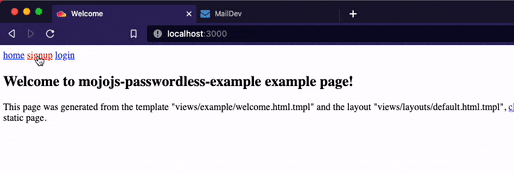

# mojojs-passwordless-example

This is an small example of doing passwordless login with [mojo.js](https://github.com/mojolicious/mojo.js).



# Run example

You need a postgresql database and email server to run the example. See below for how to easily get those running with docker.

## 1. Start postgres and create database

```sh
docker run --rm   --name pg-docker -e POSTGRES_PASSWORD=postgres -d -p 5432:5432 -v $HOME/docker/volumes/postgres:/var/lib/postgresql/data  postgres
```

```sh
psql -h 'localhost' -c "CREATE DATABASE mojojs_passwordless_example_dev" "user=postgres dbname=postgres password=postgres"
```

## 2. Start [maildev](https://github.com/maildev/maildev) email server

You will be able to check emails at http://localhost:1080.

```sh
docker run  -d -p 1080:1080 -p 1025:1025 maildev/maildev
```

## 3. Run migration

```sh
node migrate.js
```

## 4. Start [minion.js]() background worker for handling signup & login email jobs

```sh
node bg-worker.js
```

## 5. Start dev server

Leave the background worker running in a separate terminal window.

```sh
npm install
npm run build
```

```sh
npm run dev
```
